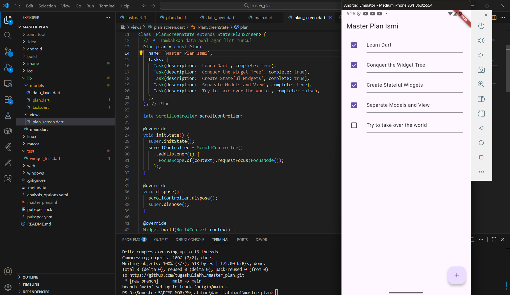
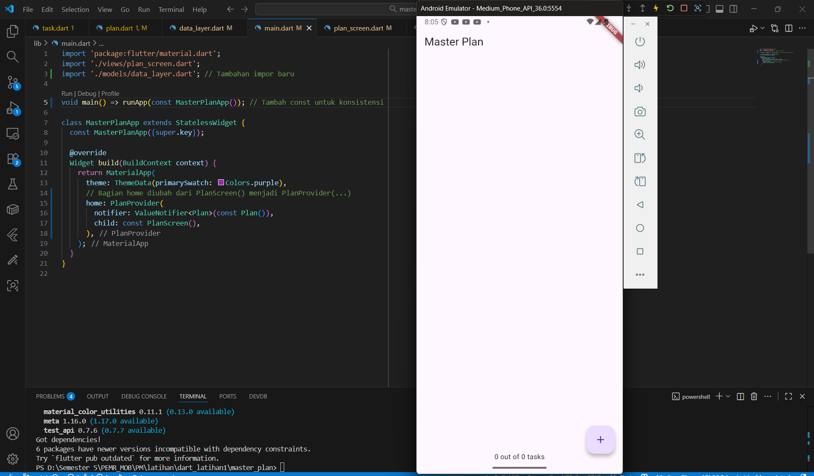
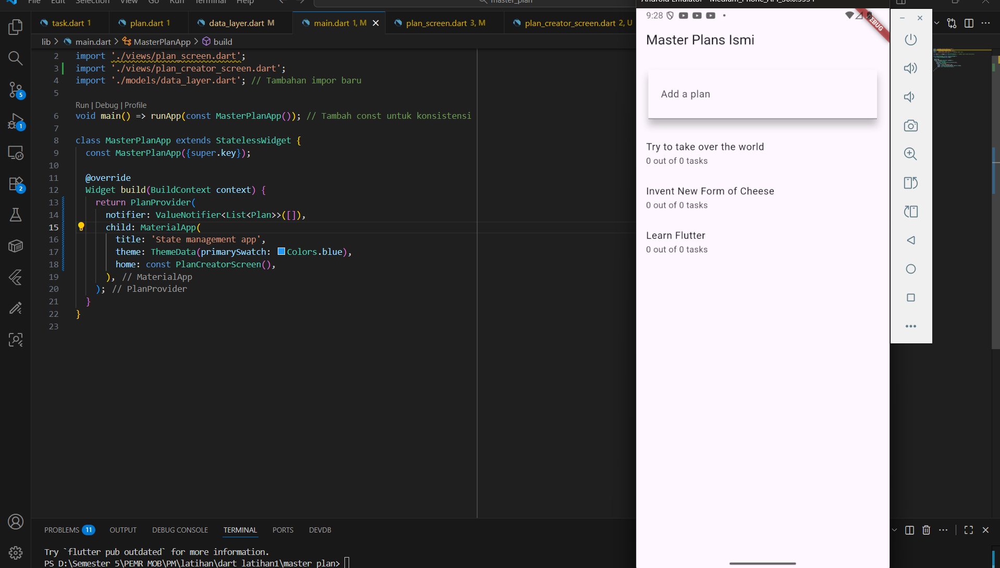
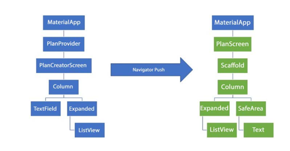

# master_plan

A new Flutter project.

# LAPORAN IMPLEMENTASI MASTER PLAN
**Nama:** Ismi Atika  
**NIM:** 2341760036  
**Kelas:** SIB3C  

## Hasil Praktikum 1

Berikut adalah hasil akhir dari Praktikum yang telah saya kerjakan

Hasil langkah 9 menampilkan aplikasi Master Plan Ismi dengan tema ungu, judul di bagian atas, dan tombol ( + ) di kanan bawah untuk menambah tugas. Tampilan ini menunjukkan bahwa aplikasi sudah berhasil menampilkan halaman utama PlanScreen sesuai rancangan praktikum.

Berikut adalah hasil akhir dari Praktikum yang telah saya kerjakan

Hasil akhir praktikum menampilkan aplikasi Master Plan Ismi dengan daftar tugas yang dapat ditandai selesai. Beberapa tugas sudah dicentang, dan satu masih aktif. Tampilan menggunakan tema ungu dengan tombol ( + ) di kanan bawah untuk menambah tugas. Aplikasi berjalan lancar tanpa error dan berhasil menerapkan konsep stateful widget serta model-view structure di Flutter.

Selanjutnya bisa melihat hasil GIF dari teks yang terdeteksi melalui video berikut:  
🎥 [Klik di sini untuk melihat video hasil Master Plan](image/Hasil_1-3.mp4)

## Hasil Praktikum 2

Berikut adalah hasil akhir dari Praktikum yang telah saya kerjakan

Hasil dari langkah 9 menampilkan aplikasi Master Plan yang sudah berhasil menampilkan tampilan utama dengan judul di bagian atas, tombol tambah (+) di kanan bawah, dan teks progres di bagian bawah bertuliskan “0 out of 0 tasks”. Tampilan ini menunjukkan bahwa struktur data Plan dan penggunaan InheritedNotifier telah berjalan dengan benar, di mana aplikasi siap menampilkan serta memperbarui daftar tugas secara dinamis saat data ditambahkan.

Selanjutnya bisa melihat hasil GIF dari tampilan yang terdeteksi melalui video berikut:  
🎥 [Klik di sini untuk melihat video hasil Master Plan](image/Hasil_2-1.mp4)

## Hasil Praktikum 3

Berikut adalah hasil akhir dari Praktikum yang telah saya kerjakan

Pada langkah ini, saya berhasil menjalankan aplikasi Master Plan App dengan konsep state management menggunakan InheritedNotifier dan ValueNotifier melalui class PlanProvider. Aplikasi dapat menampilkan daftar rencana seperti “Try to take over the world”, “Invent New Form of Cheese”, dan “Learn Flutter” dengan tampilan utama bertema biru. Hasil ini menunjukkan bahwa sistem penyimpanan dan pembagian data antar widget sudah berjalan dengan baik, serta tampilan aplikasi sudah sesuai dengan rancangan yang diharapkan.

## Soal 2 Praktikum 3

Secara keseluruhan, diagram ini menggambarkan bahwa aplikasi menggunakan mekanisme navigasi Navigator.push() untuk berpindah dari halaman pembuat rencana (PlanCreatorScreen) ke halaman detail rencana (PlanScreen). Perpindahan ini tidak hanya mengubah tampilan antar halaman, tetapi juga memperlihatkan bagaimana struktur widget dan data berpindah dari satu konteks ke konteks lainnya. Melalui pendekatan ini, setiap plan yang dipilih akan ditampilkan secara detail dengan daftar tugas di dalamnya, sehingga pengguna dapat melihat isi dan progres dari masing-masing rencana yang telah dibuat.

Selanjutnya bisa melihat hasil GIF dari tampilan yang terdeteksi melalui video berikut:  
🎥 [Klik di sini untuk melihat video hasil Master Plan](image/Hasil_3-1.mp4)